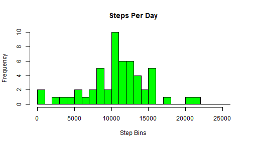
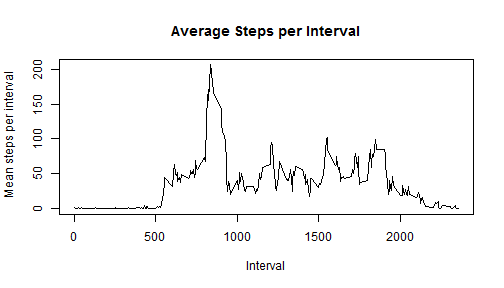
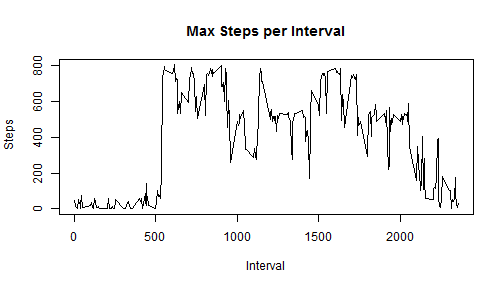
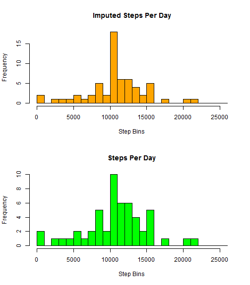
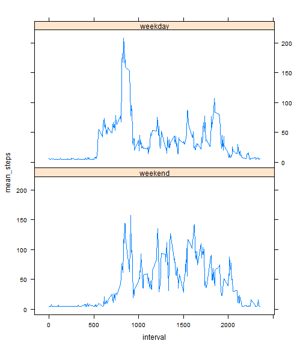

### Introduction

----------


It is now possible to collect a large amount of data about personal movement using activity monitoring devices such as a Fitbit, Nike Fuelband, or Jawbone Up. These type of devices are part of the "quantified self" movement - a group of enthusiasts who take measurements about themselves regularly to improve their health, to find patterns in their behavior, or because they are tech geeks. But these data remain under-utilized both because the raw data are hard to obtain and there is a lack of statistical methods and software for processing and interpreting the data.

This assignment makes use of data from a personal activity monitoring device. This device **collects data at 5 minute intervals** through out the day. The **data consists of two months of data** from an anonymous individual collected during the months of October and November, 2012 and include the number of steps taken in 5 minute intervals each day.

### Data

----------


The data for this assignment can be downloaded from the course web site:
https://d396qusza40orc.cloudfront.net/repdata%2Fdata%2Factivity.zip

The variables included in this dataset are:

- **steps:** Number of steps taking in a 5-minute interval (missing values are coded as NA)
- **date:** The date on which the measurement was taken in **YYYY-MM-DD** format
- **interval:** Identifier for the 5-minute interval in which measurement was taken

The dataset is stored in a comma-separated-value (CSV) file and there are a total of **17,568 observations** in this dataset.


#### Assignment setup
The dataset file activity.zip has been placed in the directory `e:/rcode/chap05/assignment1`

### Loading and preprocessing the data


```r
# load libraries
library(lubridate)
library(lattice)
library(dplyr)
```


```r
# Set the assignment working directory
project_dir <- setwd("e:/rcode/chap05/assignment1")

#unzip the file activity.zip
unzip ("activity.zip", exdir = ".")
list.files()
```

```
## [1] "activity.csv"         "activity.zip"         "PeerAssignment1.html"
## [4] "PeerAssignment1.Rmd"
```


```r
# read the data
activityDF1 <- read.table("activity.csv",  sep = ",", header = TRUE, na.strings = "NA")

#check number cols and rows and data types
nrow(activityDF1)
```

```
## [1] 17568
```

```r
ncol(activityDF1)
```

```
## [1] 3
```

```r
str(activityDF1)
```

```
## 'data.frame':	17568 obs. of  3 variables:
##  $ steps   : int  NA NA NA NA NA NA NA NA NA NA ...
##  $ date    : Factor w/ 61 levels "2012-10-01","2012-10-02",..: 1 1 1 1 1 1 1 1 1 1 ...
##  $ interval: int  0 5 10 15 20 25 30 35 40 45 ...
```


```r
# convert variables and check result
activityDF1$steps <- as.integer(activityDF1$steps)
activityDF1$date <- ymd(activityDF1$date)
str(activityDF1)
```

```
## 'data.frame':	17568 obs. of  3 variables:
##  $ steps   : int  NA NA NA NA NA NA NA NA NA NA ...
##  $ date    : POSIXct, format: "2012-10-01" "2012-10-01" ...
##  $ interval: int  0 5 10 15 20 25 30 35 40 45 ...
```


### What is mean total number of steps taken per day?

For this part of the assignment, you can ignore the missing values in the dataset.

1. Calculate the total number of steps taken per day

2. If you do not understand the difference between a histogram and a barplot, research the difference between them. Make a histogram of the total number of steps taken each day

3. Calculate and report the mean and median of the total number of steps taken per day


> Total number of steps taken per day


```r
# total numbers of steps per day
steps_per_day <- activityDF1 %>% 
  filter( steps != "NA") %>% 
  group_by(date) %>% 
  summarise_each(funs(sum), tot_steps = steps)


head(steps_per_day)
```

```
## Source: local data frame [6 x 2]
## 
##         date tot_steps
##       (time)     (int)
## 1 2012-10-02       126
## 2 2012-10-03     11352
## 3 2012-10-04     12116
## 4 2012-10-05     13294
## 5 2012-10-06     15420
## 6 2012-10-07     11015
```

> A histogram of the total number of steps taken each day


```r
# reset canvas for plotting a single chart
par(mfrow = c(1, 1))

# plot histogram
hist(steps_per_day$tot_steps, breaks = seq(0, 26000, by = 1000), col = "green", main = "Steps Per Day", xlab = "Step Bins")
```

 

> Exploring the mean and median of the total number of steps taken per day


```r
# Exploring mean and median values

steps_per_day <- activityDF1 %>% 
  filter( steps != "NA") %>% 
  group_by(date) %>% 
  summarise_each(funs(tot_steps = sum, mean_steps = mean, median_steps = median), steps)

head(steps_per_day)
```

```
## Source: local data frame [6 x 4]
## 
##         date tot_steps mean_steps median_steps
##       (time)     (int)      (dbl)        (dbl)
## 1 2012-10-02       126    0.43750            0
## 2 2012-10-03     11352   39.41667            0
## 3 2012-10-04     12116   42.06944            0
## 4 2012-10-05     13294   46.15972            0
## 5 2012-10-06     15420   53.54167            0
## 6 2012-10-07     11015   38.24653            0
```

> Reporting the mean and median of the total number of steps taken per day


```r
# Calculate and report the mean and median of the total number of steps taken per day
summary_steps_per_day <- activityDF1 %>% 
  filter( steps != "NA") %>% 
  summarise(tot_steps = sum(steps), mean_steps = mean(steps), median_steps = median(steps))

summary_steps_per_day
```

```
##   tot_steps mean_steps median_steps
## 1    570608    37.3826            0
```


### What is the average daily activity pattern?
1. Make a time series plot (i.e. type = "l") of the 5-minute interval (x-axis) and the average number of steps taken, averaged across all days (y-axis)

2. Which 5-minute interval, on average across all the days in the dataset, contains the maximum number of steps?


> A time series plot


```r
# create data frame with data for time series plot
daily_activity <- activityDF1 %>% 
  filter( steps != "NA") %>% 
  group_by(interval) %>% 
#  summarise_each(funs(mean), mean_steps = steps)
  summarise_each(funs(tot_steps = sum, mean_steps = mean, median_steps = median), steps)

head(daily_activity)
```

```
## Source: local data frame [6 x 4]
## 
##   interval tot_steps mean_steps median_steps
##      (int)     (int)      (dbl)        (int)
## 1        0        91  1.7169811            0
## 2        5        18  0.3396226            0
## 3       10         7  0.1320755            0
## 4       15         8  0.1509434            0
## 5       20         4  0.0754717            0
## 6       25       111  2.0943396            0
```

```r
# reset canvas for plotting a single chart
par(mfrow = c(1, 1))

# Plot average steps per interval
with(daily_activity, plot(interval, mean_steps , main = "Average Steps per Interval" ,xlab = "Interval", ylab = " Mean steps per interval", type = "l", ))
```

 

> Find the 5-minute interval with avg max steps


```r
#create a summary data frame with max number of steps per interval
activity_max <- activityDF1 %>% 
  filter( steps != "NA") %>% 
  group_by(interval) %>% 
  summarise_each(funs(sum_steps = sum, max_steps_in_interval = max), steps)

head(activity_max)
```

```
## Source: local data frame [6 x 3]
## 
##   interval sum_steps max_steps_in_interval
##      (int)     (int)                 (int)
## 1        0        91                    47
## 2        5        18                    18
## 3       10         7                     7
## 4       15         8                     8
## 5       20         4                     4
## 6       25       111                    52
```

```r
# reset canvas for plotting a single chart
par(mfrow = c(1, 1))

# use a plot to explore what the data looks like
with(activity_max, plot(interval, max_steps_in_interval , main = "Max Steps per Interval" ,xlab = "Interval", ylab = " Steps", type = "l", ))
```

 
```
From the plot it can be seen the max steps in an interval is approximately 800
```

```r
# Now, extract the observation with the max steps at that given interval
max_steps_obs <- filter(activity_max, max_steps_in_interval == max(max_steps_in_interval)) 

head(max_steps_obs)
```

```
## Source: local data frame [1 x 3]
## 
##   interval sum_steps max_steps_in_interval
##      (int)     (int)                 (int)
## 1      615      3363                   806
```

> The interval with the max steps is the interval at 615 minutes and the max steps is 806

### Imputing missing values

Note that there are a number of days/intervals where there are missing values (coded as NA). The presence of missing days may introduce bias into some calculations or summaries of the data.

1. Calculate and report the total number of missing values in the dataset (i.e. the total number of rows with NAs)

2. Devise a strategy for filling in all of the missing values in the dataset. The strategy does not need to be sophisticated. For example, you could use the mean/median for that day, or the mean for that 5-minute interval, etc.

3. Create a new dataset that is equal to the original dataset but with the missing data filled in.

4. Make a histogram of the total number of steps taken each day and Calculate and report the mean and median total number of steps taken per day. Do these values differ from the estimates from the first part of the assignment? What is the impact of imputing missing data on the estimates of the total daily number of steps?


> Calculate the number of NAs


```r
# subset the observations with na
na_activity <- activityDF1 %>% 
  filter(is.na(steps))

# get the count of observations with na
count_of_na <- nrow(na_activity)
nrow(na_activity)
```

```
## [1] 2304
```

```r
# validate the result by doing a little arithmetic 

# create a subset of  observations witjout NAs
not_na <- activityDF1 %>% 
  filter(steps != "NA")

count_of_notna <- nrow(not_na)
nrow(not_na)
```

```
## [1] 15264
```

```r
# check the arithmetic
if(nrow(activityDF1) == count_of_na + count_of_notna) 
  print("counts validate")
```

```
## [1] "counts validate"
```

> Fill missing values

```
Strategy for filling missing values. If there is a missing value, use the average number steps for an interval across all days.
```

```r
# find mean on steps across all days
mean_all_days <- mean(activityDF1$steps, na.rm = TRUE)
mean_all_days
```

```
## [1] 37.3826
```

```r
# create a new dataset with all NAs replaced by the value of "mean-all_days"
no_missing_values <- activityDF1

no_missing_values$steps[is.na(no_missing_values$steps)]<- mean_all_days

nrow(no_missing_values)
```

```
## [1] 17568
```

```r
head(no_missing_values)
```

```
##     steps       date interval
## 1 37.3826 2012-10-01        0
## 2 37.3826 2012-10-01        5
## 3 37.3826 2012-10-01       10
## 4 37.3826 2012-10-01       15
## 5 37.3826 2012-10-01       20
## 6 37.3826 2012-10-01       25
```


- Make a histogram of the total number of steps taken each day and...
- Calculate and report the mean and median total number of steps taken per day. 
- Do these values differ from the estimates from the first part of the assignment? 
- What is the impact of imputing missing data on the estimates of the total daily number of steps?


> Total number of steps taken per day, with imputed values added


```r
# total numbers of steps per day
imputed_steps_per_day <- no_missing_values %>% 
  filter( steps != "NA") %>% 
  group_by(date) %>% 
  summarise_each(funs(sum), tot_steps = steps)

head(imputed_steps_per_day)
```

```
## Source: local data frame [6 x 2]
## 
##         date tot_steps
##       (time)     (dbl)
## 1 2012-10-01  10766.19
## 2 2012-10-02    126.00
## 3 2012-10-03  11352.00
## 4 2012-10-04  12116.00
## 5 2012-10-05  13294.00
## 6 2012-10-06  15420.00
```

> "Stacked"" histograms to compare orginal histogram to new histogram


```r
# reset canvas for plotting a single chart
par(mfrow = c(2, 1))

# plot imputted steps histogram
hist(imputed_steps_per_day$tot_steps, breaks = seq(0, 26000, by = 1000), col = "orange", main = "Imputed Steps Per Day", xlab = "Step Bins")

# plot original historgram
hist(steps_per_day$tot_steps,  breaks = seq(0, 26000, by = 1000), col = "green", main = "Steps Per Day", xlab = "Step Bins")
```

 

> The mean and median of the total number of steps taken per day


```r
# calculate the mean, median and tot steps
summary_imputed_steps_per_day <- no_missing_values %>% 
  filter( steps != "NA") %>% 
  summarise(tot_steps = sum(steps), mean_steps = mean(steps), median_steps = median(steps))

summary_imputed_steps_per_day
```

```
##   tot_steps mean_steps median_steps
## 1  656737.5    37.3826            0
```

```r
# total percentage change in total steps
percent_change_in_steps <- ((summary_imputed_steps_per_day$tot_steps / summary_steps_per_day$tot_steps) * 100) - 100

percent_change_in_steps
```

```
## [1] 15.09434
```


> The mean, and median steps are identical to the estimate from earlier in the assignment  
> However, the number of total steps has increased by approximately 15%

### Are there differences in activity patterns between weekdays and weekends?

For this part the weekdays() function may be of some help here. Use the dataset with the filled-in missing values for this part.

1. Create a new factor variable in the dataset with two levels - "weekday" and "weekend" indicating whether a given date is a weekday or weekend day.


```r
# create a new data frame that can be grouped by "weekday" and "weekend""
weekday_weekend <- no_missing_values %>% 
  mutate(day_number = wday(date)) %>%
  mutate(type_of_day = factor(1 * (day_number == 1 | day_number == 7), labels = c("weekday", "weekend"))) %>%
  group_by(type_of_day) %>% 
  summarise_each(funs(sum), tot_steps = steps)

# check to see if a factor variable was created
str(weekday_weekend)
```

```
## Classes 'tbl_df', 'tbl' and 'data.frame':	2 obs. of  2 variables:
##  $ type_of_day: Factor w/ 2 levels "weekday","weekend": 1 2
##  $ tot_steps  : num  461513 195224
```

```r
head(weekday_weekend)
```

```
## Source: local data frame [2 x 2]
## 
##   type_of_day tot_steps
##        (fctr)     (dbl)
## 1     weekday  461513.1
## 2     weekend  195224.4
```


2. Make a panel plot containing a time series plot (i.e. type = "l") of the 5-minute interval (x-axis) and the average number of steps taken, averaged across all weekday days or weekend days (y-axis). See the README file in the GitHub repository to see an example of what this plot should look like using simulated data


```r
# create a new data frame that can be grouped by "weekday" and "weekend""
weekday_weekend <- no_missing_values %>% 
  mutate(day_number = wday(date)) %>%
  mutate(type_of_day = factor(1 * (day_number == 1 | day_number == 7), labels = c("weekday", "weekend"))) %>%
  group_by(interval) 

head(weekday_weekend)
```

```
## Source: local data frame [6 x 5]
## Groups: interval [6]
## 
##     steps       date interval day_number type_of_day
##     (dbl)     (time)    (int)      (dbl)      (fctr)
## 1 37.3826 2012-10-01        0          2     weekday
## 2 37.3826 2012-10-01        5          2     weekday
## 3 37.3826 2012-10-01       10          2     weekday
## 4 37.3826 2012-10-01       15          2     weekday
## 5 37.3826 2012-10-01       20          2     weekday
## 6 37.3826 2012-10-01       25          2     weekday
```

```r
# subset to steps taken on the weekday
weekday_steps <- weekday_weekend %>%
  filter(type_of_day == "weekday") %>%
  group_by(interval) %>%
  summarise_each(funs(sum_steps = sum, max_steps_in_interval = max, mean_steps = mean), steps) %>%
  mutate(type_of_day = factor(1* (1 == 1), labels = c("weekday")))

nrow(weekday_steps)
```

```
## [1] 288
```

```r
head(weekday_steps)
```

```
## Source: local data frame [6 x 5]
## 
##   interval sum_steps max_steps_in_interval mean_steps type_of_day
##      (int)     (dbl)                 (dbl)      (dbl)      (fctr)
## 1        0  315.2956               47.0000   7.006569     weekday
## 2        5  242.2956               37.3826   5.384347     weekday
## 3       10  231.2956               37.3826   5.139902     weekday
## 4       15  232.2956               37.3826   5.162124     weekday
## 5       20  228.2956               37.3826   5.073235     weekday
## 6       25  283.2956               37.3826   6.295458     weekday
```

```r
# subset to steps taken on the weekend
weekend_steps <- weekday_weekend %>%
  filter(type_of_day == "weekend") %>%
  group_by(interval) %>%
  summarise_each(funs(sum_steps = sum, max_steps_in_interval = max, mean_steps = mean), steps) %>%
  mutate(type_of_day = factor(1* (1 == 1), labels = c("weekend")))

nrow(weekend_steps)
```

```
## [1] 288
```

```r
head(weekend_steps)
```

```
## Source: local data frame [6 x 5]
## 
##   interval sum_steps max_steps_in_interval mean_steps type_of_day
##      (int)     (dbl)                 (dbl)      (dbl)      (fctr)
## 1        0   74.7652               37.3826   4.672825     weekend
## 2        5   74.7652               37.3826   4.672825     weekend
## 3       10   74.7652               37.3826   4.672825     weekend
## 4       15   74.7652               37.3826   4.672825     weekend
## 5       20   74.7652               37.3826   4.672825     weekend
## 6       25  126.7652               52.0000   7.922825     weekend
```

```r
# combine the data frames
all_days_steps <- rbind(weekend_steps, weekday_steps)

# plot the 2 panels
xyplot(mean_steps ~ interval | type_of_day , data = all_days_steps, type = "l",layout = c(1, 2))
```

 

> From the chart, it can been seen that weekdays appear to have more activity than weekends between the intervals 500 to 700. Weekends seem to have more activtity than weekdays, between the intervals of 1000 to 1700.
